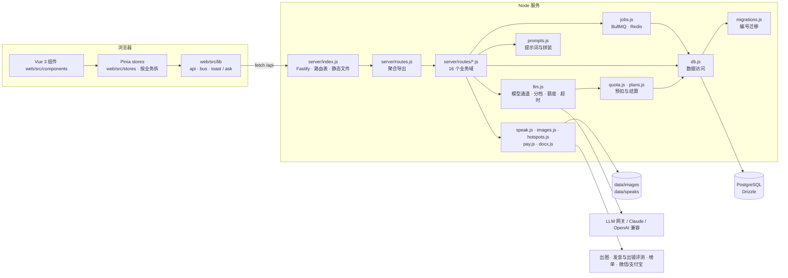

# 自媒体助手 · 架构说明

给第一次接手代码的人看：模块怎么分、一次请求怎么走、改东西去哪。设计取舍的来龙去脉在 README 里。
为什么选这些技术、现状取舍、什么时候换，见 `docs/TECH-DECISIONS.md`；通用的分层、注释、编码规范见 `docs/NEW-PROJECT-TECH-GUIDE.md`。

## 一张图



## 技术栈

| 部分 | 用的是 | 说明 |
|---|---|---|
| 前端 | Vue 3 + Pinia（`web/`） | Vite 构建进 `dist/`（不进 git），应用、后台、说明书、落地页、营销页五个入口。样式在 `web/src/styles/` |
| 后端 | Node.js ≥ 22.5（ESM），Fastify | 路由仍是原来的处理函数；请求在读 body 前交给它们，上传和流式输出不经过框架解析 |
| 队列 | Redis + BullMQ | 任务状态在 PostgreSQL。`REDIS_URL` 默认 `redis://127.0.0.1:6379` |
| 数据库 | PostgreSQL + Drizzle | `DATABASE_URL`，默认 `postgres://127.0.0.1:5432/ip_studio`。表在 `server/schema.js`，变更只在 `server/migrations.js` 末尾追加 |
| 部署 | nginx 反代 + pm2 + rsync | `scripts/deploy-jdcloud.sh`，每日备份 `scripts/backup.sh` |
| 测试 | Node 内置 `node:test` | `npm test`：先跑 `scripts/check.js` 再跑 `tests/*.test.js` |

## 一次请求怎么走

1. `server/index.js` 收到请求：`/api/*` 先过 `limit.js` 的限流，再在 `ROUTES` 表里按方法 + 正则找处理函数；
   其余路径当静态文件（`/admin`、`/prompts`、`/start` 等有独立入口）。
2. 处理函数在 `server/routes/<业务域>.js`，统一签名 `(req, res, body, params, url)`。
   开头 `requireUser(req)` 或 `requireAdmin(req)`，结尾 `json(res, 200, {...})`；抛 `HttpError(状态码, 文案)` 由 index.js 转成 JSON 错误。
3. 要调模型时走 `llm.js` 的三个函数之一：`generateJSON`（结构化）、`generateText`（短文本）、`streamText`（流式）。
   每次调用都经过 `tracked()`：
   - 按 `FEATURE_TIER` 决定走 quality 还是 fast 档；
   - 同一用户最多 3 个并发（`LLM_MAX_INFLIGHT_PER_USER`）；
   - 额度**预扣**一笔估算，调完按真实 token **结算**多退少补，失败退回、中断按已生成字数收；
   - 写一条 `usage_events`（功能、模型、耗时、token、提示词变体）。
4. 模型输出一律在代码里校验再用：引用必须能在原文逐字找到、字段不全重试一次、凑数的提示过滤掉。

## 业务域（server/routes/）

| 文件 | 管什么 |
|---|---|
| `common.js` | 共用小工具：`json`、`requireUser`、`requireAdmin`、`describe`（错误文案）、`withRetry`、语气样本 |
| `auth.js` | 注册、登录、登出、当前用户、站点元信息 |
| `prompts.js` | 提示词说明书读取；编辑与切换版本仅管理员 |
| `admin.js` | 后台登录、用量概览、运行时配置、A/B 变体、eval |
| `personas.js` | 账号设定、内容栏目、语气样本与档案 |
| `hotspots.js` | 榜单、热点比对、题材推荐 |
| `drafts.js` | 三个方向、流式成稿、保存与历史、列表、归档、删除 |
| `review.js` | 成稿检查（`cleanReview` 是纯函数，有单测） |
| `speak.js` | 口播提示、口播录音与评测 |
| `editor.js` | 划词改写、`/` 续写、语音改稿 |
| `publish.js` | 多平台版本、配图、Word 导出 |
| `materials.js` | 素材库（`recallMaterials` 召回）与选题池 |
| `insights.js` | 发布数据回填与复盘 |
| `billing.js` | 套餐、下单、支付回调 |
| `frameworks.js` | 写法框架库、从范文拆解 |
| `jobs.js` | 任务中心：长任务的进度、取消、重试 |

## 前端（web/）

全部是 Vue 3 + Pinia，Vite 构建进 `dist/`（不进 git）。五个页面各自一个入口：

| 页面 | 地址 | 入口 |
|---|---|---|
| 应用 | `/`、`/app` | `web/index.html` → `src/main.js` → `App.vue` |
| 管理后台 | `/admin` | `web/admin.html` → `src/admin/` |
| 提示词说明书 | `/prompts` | `web/prompts.html` → `src/prompts/` |
| 落地页 | `/about`（未登录访问 `/` 也是它） | `web/landing.html` → `src/landing/` |
| 营销页 | `/start` | `web/promo.html` → `src/promo/` |

应用的目录：

- `src/components/`：界面。`App.vue` 拼骨架；`TopBar`、`Sidebar`、`WriteView`（步骤条 + `BriefCard` / `TopicsCard` / `ContentCard`）、`HotView`；各个浮层（`*Modal.vue`）；`common/` 是通用件（`Modal` 浮层壳、`AskDialog` 应用内确认框、`Toast`、`BusyBtn`）。
- `src/stores/`：数据和动作，一个业务一个 store。`studio` 是各块共用的（登录用户、站点信息、当前账号、当前稿子、第几步、模式）；其余按业务拆：
  `session` 登录与启动 · `account` 账号设定（含素材库、语气样本、快速建号）· `brief` 简报与方向（含推荐题材、选题池）· `history` 创作记录 ·
  `sections` 栏目 · `frameworks` 写法框架 · `hot` 热点 · `editor` 成稿区（流式成稿、保存、改写、正文历史、语音改稿、导出）·
  `versions` 多平台与配图 · `review` 成稿检查 · `speak` 口播 · `prompter` 提词器 · `plan` 用量与支付 · `jobs` 后台任务 · `titles` 标题 · `insights` 回填与复盘。
- `src/lib/`：不依赖界面的小工具。`api.js`（请求、流式、上传、下载）、`bus.js`（模块间通知）、`feedback.js`（`toast`、`ask`）、`busy.js`（提交中的锁）、`text.js`（Markdown、转义、日期）、`caret.js`（编辑框光标坐标）、`escape.js`（Esc 只关最上层）、`reveal.js`（营销页渐入）。
- `src/styles/`：`base.css`（设计令牌 + 通用控件，各页面都先引它）、`shell.css`（登录页、顶栏、侧栏）、`create.css`（创作前两步）、`workbench.css`（成稿工作台）、`views.css`（热点、账号设定、提词器、各弹窗）、`admin.css`，以及落地页、营销页、说明书各自的样式。设计依据是 `docs/LOVART-PROMPTS-WEB.md` 和 `export/` 里的设计图。图标是 `components/common/Icon.vue` 里自己画的线性图标，不引图标库。`web/public/` 里的图标原样拷到 `dist/` 根目录。
- `shared/place.js`：插图位置算法，前端阅读区和服务端导出 Word 共用一份。

约定：

- **组件只管界面，数据和动作放 store**。组件之间要用同一份数据就放进 store，不要层层传 props、也不要按 id 去找别的组件的 DOM。
- 模板里的 `{{ }}` 会自动转义；只有 Markdown 正文、带高亮的口播句子这种要 `v-html` 的，HTML 必须来自 `lib/text.js` 的 `markdown()` / `highlightStress()`（先转义再加标签）。
- 确认、填表用 `lib/feedback.js` 的 `ask.confirm` / `ask.form`，提示用 `toast`，不用浏览器原生弹窗。
- 浮层用 `common/Modal.vue`（`v-model:open`，Esc 只关最上面一层）。开关用 `hidden` 类：关上再开里面的输入不丢，浏览器测试也按 `.hidden` 判断。
- 「通知」而不是「调用」的地方用 `lib/bus.js`：`spent`（花了点数，刷新余额）、`quota`（额度不够，弹用量面板）、`enter`（登录后进了应用）、`job-done`（后台任务做完）。
- 模板最外层不要以注释开头（注释算一个根节点，`v-show` 和传进来的 `class` 会失效），`scripts/check.js` 会拦。

## 数据

23 张表，按用途分：

| 用途 | 表 |
|---|---|
| 账号与会话 | `users`、`sessions`、`admins`、`admin_sessions` |
| 账号设定 | `personas`、`sections`、`style_samples` |
| 创作 | `drafts`、`draft_revisions`、`speak_takes`、`frameworks` |
| 复盘 | `draft_metrics`（发布数据快照，一次回填一行） |
| 后台任务 | `jobs`（出图、口播转写与评测；worker 在 `server/jobs.js`） |
| 素材与选题 | `materials`、`topic_pool` |
| 提示词 | `prompt_revisions`、`prompt_variants`、`eval_cases`、`eval_runs`、`eval_votes` |
| 计费与运营 | `orders`、`usage_events`、`settings` |

`drafts` 里有多个 JSON 列（方向、账号快照、口播提示、多平台版本、配图、发布数据），读写在 `db.js` 的 `Drafts` 里集中处理。
录音和图片存在 `data/speaks/<用户>/`、`data/images/<用户>/`，只能由本人访问（`index.js` 的 `serveOwned`）。

## 改东西去哪

| 想改 | 去哪 |
|---|---|
| 写作规则、平台规范、调性 | `server/prompts.js`；运行时由管理员在 `/prompts` 页在线改（有版本历史） |
| 哪个功能用哪个档的模型 | `server/llm.js` 的 `FEATURE_TIER`；快档模型用 `ANTHROPIC_MODEL_FAST` / `OPENAI_MODEL_FAST` / `LLM_CAPABILITY_JSON` |
| 套餐、点数、单价 | `server/plans.js`、`server/pricing.js` |
| 新接口 | `server/index.js` 的 `ROUTES` 加一行 + 对应 `server/routes/<域>.js` 里 export 处理函数 |
| 要跑很久的活 | 在业务路由里 `defineJob` 登记一种任务，接口里 `enqueue`；前端用 `stores/jobs.js` 的 `start` / `wait` |
| 表结构 | `server/schema.js` 改字段，并在 `server/migrations.js` 末尾加一个编号迁移 |
| 页面结构 / 样式 | `web/src/components/*.vue` / `web/src/styles/*.css`（令牌在 `base.css` 开头）。改完 `npm run build:web` |
| 页面行为、数据 | `web/src/stores/<业务>.js` |

## 本地开发

```bash
npm install
# 本机要有 PostgreSQL，并建好库：createdb ip_studio
# 不设 DATABASE_URL 时默认连 postgres://127.0.0.1:5432/ip_studio
LLM_PROVIDER=mock IMAGE_PROVIDER=mock npm run dev   # 演示模式，不花钱，改完自动重启
npm test                                            # 检查 + 单测（用临时 schema，不读 .env）
```
