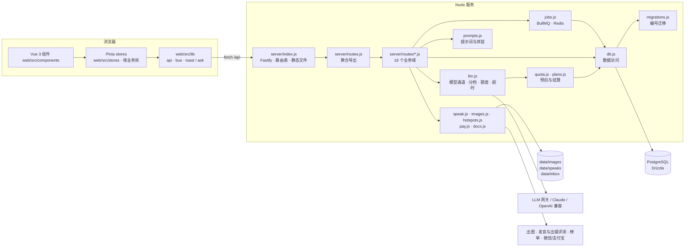

# 自媒体助手 · 架构说明

给第一次接手代码的人看：模块怎么分、一次请求怎么走、改东西去哪。设计取舍的来龙去脉在 README 里。
为什么选这些技术、现状取舍、什么时候换，见 `docs/TECH-DECISIONS.md`；通用的分层、注释、编码规范见 `docs/NEW-PROJECT-TECH-GUIDE.md`。

## 一张图



## 技术栈

| 部分 | 用的是 | 说明 |
|---|---|---|
| 前端 | Vue 3 + Pinia（`web/`） | Vite 构建进 `dist/`（不进 git），应用、后台、说明书、落地页、营销页五个入口。样式在 `web/src/styles/` |
| 后端 | Node.js ≥ 22.5（ESM），Fastify | 路由仍是原来的处理函数；请求在读 body 前交给它们，上传和流式输出不经过框架解析 |
| 队列 | Redis + BullMQ | 任务状态在 PostgreSQL。`REDIS_URL` 默认 `redis://127.0.0.1:6379` |
| 数据库 | PostgreSQL + Drizzle | `DATABASE_URL`，默认 `postgres://127.0.0.1:5432/ip_studio`。表在 `server/schema.js`，变更只在 `server/migrations.js` 末尾追加 |
| 部署 | nginx 反代 + pm2 + rsync | `scripts/deploy-jdcloud.sh`，每日备份 `scripts/backup.sh` |
| 测试 | Node 内置 `node:test` | `npm test`：先跑 `scripts/check.js` 再跑 `tests/*.test.js` |

## 一次请求怎么走

1. `server/index.js` 收到请求：`/api/*` 先过 `limit.js` 的限流，再在 `ROUTES` 表里按方法 + 正则找处理函数；
   其余路径当静态文件（`/admin`、`/prompts`、`/start` 等有独立入口）。
2. 处理函数在 `server/routes/<业务域>.js`，统一签名 `(req, res, body, params, url)`。
   开头 `requireUser(req)` 或 `requireAdmin(req)`，结尾 `json(res, 200, {...})`；抛 `HttpError(状态码, 文案)` 由 index.js 转成 JSON 错误。
3. 要调模型时走 `llm.js` 的三个函数之一：`generateJSON`（结构化）、`generateText`（短文本）、`streamText`（流式）。
   每次调用都经过 `tracked()`：
   - 按 `FEATURE_TIER` 决定走 quality 还是 fast 档；
   - 同一用户最多 3 个并发（`LLM_MAX_INFLIGHT_PER_USER`）；
   - 额度**预扣**一笔估算，调完按真实 token **结算**多退少补，失败退回、中断按已生成字数收；
   - 写一条 `usage_events`（功能、模型、耗时、token、提示词变体）。
4. 模型输出一律在代码里校验再用：引用必须能在原文逐字找到、字段不全重试一次、凑数的提示过滤掉。

## 业务域（server/routes/）

| 文件 | 管什么 |
|---|---|
| `common.js` | 共用小工具：`json`、`requireUser`、`requireAdmin`、`describe`（错误文案）、`withRetry`、语气样本 |
| `auth.js` | 注册、登录、登出、当前用户、站点元信息 |
| `prompts.js` | 提示词说明书读取；编辑与切换版本仅管理员 |
| `admin.js` | 后台登录、用量概览、运行时配置、A/B 变体、eval |
| `personas.js` | 账号设定、内容栏目、语气样本与档案 |
| `hotspots.js` | 榜单、热点比对、题材推荐 |
| `drafts.js` | 三个方向、流式成稿、保存与历史、列表、归档、删除 |
| `review.js` | 成稿检查（`cleanReview` 是纯函数，有单测） |
| `speak.js` | 口播提示、口播录音与评测 |
| `editor.js` | 划词改写、`/` 续写、语音改稿 |
| `publish.js` | 多平台版本、配图、Word 导出 |
| `materials.js` | 素材库（`recallMaterials` 召回）与选题池 |
| `insights.js` | 发布数据回填与复盘 |
| `billing.js` | 套餐、下单、支付回调 |
| `frameworks.js` | 写法框架库、从范文拆解 |
| `jobs.js` | 任务中心：长任务的进度、取消、重试 |
| `mobile.js` | 手机 App：今天、内容日历与标记发布、离线收件箱、发布包 |
| `benchmarks.js` | 对标速存：抓网页 / 粘贴文本拆提纲，转存素材或框架（抓取与 SSRF 防护在 `server/webpage.js`） |
| `export.js` | 同步到 Obsidian：同步密钥、成稿增量导出、配图与插件文件下载 |

## 移动端接口

手机 App 是「随身」用的：看今天该干嘛、路上记灵感、到点把成稿复制出去发。写作改稿仍在网页上做，
这些接口只做聚合和搬运，不调模型、不扣额度。

**鉴权**：和网页共用 `sessions` 表和 14 天有效期。`POST /api/auth/login`、`/api/auth/register` 带请求头 `X-Client: app` 时，
回包里多一个 `token`（cookie 照发）；之后每次请求带 `Authorization: Bearer <token>`。`currentUser` 先认 cookie，没有 cookie 才认 Bearer，
所以 `/image/...` 这类本人文件也能用 Bearer 取。`POST /api/auth/logout` 会删掉这次请求所用的那条服务端会话（cookie 或 Bearer），不只是清 cookie。

日期一律按 UTC 算（和回填快照的 `captured_on` 一致）。`persona` 参数：不传或空 = 全部账号，`none` = 未绑定账号的，数字 = 该账号。

| 方法 | 路径 | 说明 |
|---|---|---|
| GET | `/api/today?persona=` | 首页：`quota`（剩余点数，`low` = 剩不到 15%）、`metricsDue`（发布后第 1 / 7 天该回填却没有那天及以后的快照；两个都欠只提第 7 天；只看 30 天内发布的）、`jobs`（在跑个数 + 7 天内最近 5 条失败）、`poolUnused`、`ready`（成稿未发，最多 10 篇）、`speakTodo`（有口播提示但没有 ≥ 60 分的录音，最多 5 篇）、`week`（本周一到周日，规则同日历） |
| GET | `/api/calendar?from=&to=&persona=` | 每天一格（最多 62 天）。稿子落在发布日；没发按关联选题（`topic_pool.draft_id`）的排期；再没有、但已成稿的按最后修改日；归档的不算。`states` 可叠加：`done` 成稿未发、`cue` 待练口播、`published`、`metrics` 该回填 |
| PUT | `/api/drafts/:id/published` | `{ date: 'YYYY-MM-DD' \| '' }` 标记 / 取消发布，只改 `published_at` |
| POST | `/api/inbox` | 离线收件箱，一批最多 50 条，`kind` 为 `pool`（进选题池，来源默认「灵感」）或 `material`（进素材库，要选账号）。每条带客户端生成的 `key`（8–64 位），按 `(user_id, key)` 记在 `inbox_keys`，重发只回上次结果并标 `duplicate: true`。可带一张 JPEG / PNG 的 data URL（≤ 3MB，校验文件头），存到 `data/inbox/u<用户>-<随机>.<扩展名>`，并在备注 / 正文末尾加一行「图片：<地址>」。单条出错不影响整批，总是 200。这个接口的请求体上限放宽到 24MB |
| GET | `/api/inbox/files/:name` | 收件箱图片，文件名前缀的用户号必须是当前用户，文件名不合格式（含路径穿越）一律 400 |
| GET | `/api/drafts/:id/package` | 发布包：原文 + 每个平台版本各一份，`title`（正文首行 `# 标题` 优先）、纯文本 `body`（去掉 Markdown 和插图占位）、`tags`（`#话题#` 和 `#话题 `，最多 10 个）、`images`（已出的配图，地址同网页）、`limits`（标题上限取 `TITLE_LIMITS`，正文没有平台硬上限，为 null）、`checks`（标题按字符数、正文按去空白字数） |
| GET / POST | `/api/personas/:id/benchmarks` | 对标列表 / 新建。新建传 `{ url }` 由服务端抓取，或 `{ text, title }` 粘贴；只存标题、提纲（h1–h3，不够取段落首句，最多 12 条）和约 300 字摘要。抓不到回 422 并提示改用粘贴 |
| DELETE | `/api/benchmarks/:bid` | 删一条对标 |
| POST | `/api/transcribe` | 语音记灵感：原始音频请求体（同 `speaks` 的上传方式，`content-type` 为音频类型），只转写不评测、不扣额度，回 `{ text }`。按用户限流（10 分钟 60 次）；转不出 2 个字以上回 400「没有听清」 |
| POST | `/api/benchmarks/:bid/save` | `{ to: 'material' }` 存成「案例」素材；`{ to: 'framework' }` 提纲每条一段、篇幅平均，写明「只学结构，不抄内容」，摘要存进 `source_text` 供防洗稿比对；提纲不到 2 条回 422 |

对标抓取的 SSRF 防护（`server/webpage.js`）：只认 http / https；每一跳自己解析 DNS，解析结果里有私有、回环、链路本地、CGNAT、组播、保留、文档段
（含 IPv6 和 `::ffff:` 映射）就拒绝，并且用检查过的地址去连（防 DNS 重绑定）；重定向自己跟，最多 3 跳；8 秒超时；正文 2MB 封顶；
只收 `text/html`、`text/plain`。另外按用户限流（10 分钟 30 次，`limit.js` 的 `userLimit`）。测试里要抓本机的小网站，
只有 `NODE_ENV=test` 且 `BENCHMARK_ALLOW_PRIVATE=1` 时才放过内网地址。

## 同步到 Obsidian

`obsidian-plugin/` 是一个不用编译的 Obsidian 插件（说明见 [obsidian-plugin/README.md](../obsidian-plugin/README.md)），
定期把成稿写进用户的知识库。服务端只为它加了同步密钥和只读导出（`server/routes/export.js`，迁移 7 建 `sync_keys` 表）。

**同步密钥**：`ips_` + 40 位十六进制，服务端只存 sha256，`prefix` 留明文前几位给人认。每个用户最多 5 把。
密钥**只认 `/api/export/*`**——`currentUser` 不认它，所以拿密钥调别的接口等于没登录；泄露了也只能读成稿。
用的时候记 `last_used_at`（最多一分钟写一次）。

| 方法 | 路径 | 说明 |
|---|---|---|
| GET / POST | `/api/sync-keys` | 登录后：列表（不含密钥）/ 生成（明文只在这次回包里出现）。`{ name }` 可选 |
| DELETE | `/api/sync-keys/:kid` | 作废，立即失效 |
| GET | `/api/export/drafts?cursor=&limit=` | 同步密钥或登录态。只给 `status = done` 且有正文的稿子，按 `(updated_at, id)` 升序增量翻页（`limit` 默认 50、最多 100）。回 `{ user, items, cursor, more }`：客户端存下 `cursor` 下次接着拿；没有新的时 `cursor` 原样返回。也收 `since=<ISO 时间>`。每条带标题、账号、平台、发布日期、栏目、框架、话题标签、`markdown`、`images`、`variants`（其他平台版本，结构同正文） |
| GET | `/api/export/images/:name` | 同步密钥或登录态，只给本人 `data/images/<用户>/` 下的图 |
| GET | `/api/export/plugin/:file` | 公开：插件的 `main.js` / `manifest.json` / `styles.css`，网页「同步」里直接下载 |

导出的 `markdown` 已经是 Obsidian 能用的：插图按 `shared/place.js` 的规则放回原位（有「此处放图片」标记的占标记的位置，
模型挑位置的插在锚点那段之后，没出图的位置去掉），写成 ``，插件下载图片后换成 `![[附件路径]]`。
`updated_at` 在改正文、标题、配图、多平台版本、发布日期时都会变，所以这些改动都会被同步到。

## 手机 App（mobile/）

uni-app（Vue 3 + Pinia）的 Vite 命令行工程，一套代码出 H5、安卓 / iOS App、微信小程序，依赖只装在 `mobile/` 里。
只调上面这些接口和网页已有的接口（出稿、改稿、口播、配图、复盘），不另设后端。页面清单、离线策略、第一版没做的事见 [mobile/README.md](../mobile/README.md)。

- 鉴权走 Bearer（见上）；`lib/api.js` 统一加请求头，401 清 token 回登录页。
- 灵感离线队列在本机，按 `key` 幂等上传 `/api/inbox`；没网录的口播也先存本机。
- `scripts/check.js` 把 `mobile/src` 按 H5 / App / 小程序三种条件编译分别展开检查，并拦下和 uni 组件同名的 setup 变量。

## 前端（web/）

全部是 Vue 3 + Pinia，Vite 构建进 `dist/`（不进 git）。五个页面各自一个入口：

| 页面 | 地址 | 入口 |
|---|---|---|
| 应用 | `/`、`/app` | `web/index.html` → `src/main.js` → `App.vue` |
| 管理后台 | `/admin` | `web/admin.html` → `src/admin/` |
| 提示词说明书 | `/prompts` | `web/prompts.html` → `src/prompts/` |
| 落地页 | `/about`（未登录访问 `/` 也是它） | `web/landing.html` → `src/landing/` |
| 营销页 | `/start` | `web/promo.html` → `src/promo/` |

应用的目录：

- `src/components/`：界面。`App.vue` 拼骨架；`TopBar`、`Sidebar`、`WriteView`（步骤条 + `BriefCard` / `TopicsCard` / `ContentCard`）、`HotView`；各个浮层（`*Modal.vue`）；`common/` 是通用件（`Modal` 浮层壳、`AskDialog` 应用内确认框、`Toast`、`BusyBtn`）。
- `src/stores/`：数据和动作，一个业务一个 store。`studio` 是各块共用的（登录用户、站点信息、当前账号、当前稿子、第几步、模式）；其余按业务拆：
  `session` 登录与启动 · `account` 账号设定（含素材库、语气样本、快速建号）· `brief` 简报与方向（含推荐题材、选题池）· `history` 创作记录 ·
  `sections` 栏目 · `frameworks` 写法框架 · `hot` 热点 · `editor` 成稿区（流式成稿、保存、改写、正文历史、语音改稿、导出）·
  `versions` 多平台与配图 · `review` 成稿检查 · `speak` 口播 · `prompter` 提词器 · `plan` 用量与支付 · `jobs` 后台任务 · `titles` 标题 · `insights` 回填与复盘。
- `src/lib/`：不依赖界面的小工具。`api.js`（请求、流式、上传、下载）、`bus.js`（模块间通知）、`feedback.js`（`toast`、`ask`）、`busy.js`（提交中的锁）、`text.js`（Markdown、转义、日期）、`caret.js`（编辑框光标坐标）、`escape.js`（Esc 只关最上层）、`reveal.js`（营销页渐入）。
- `src/styles/`：`base.css`（设计令牌 + 通用控件，各页面都先引它）、`shell.css`（登录页、顶栏、侧栏）、`create.css`（创作前两步）、`workbench.css`（成稿工作台）、`views.css`（热点、账号设定、提词器、各弹窗）、`admin.css`，以及落地页、营销页、说明书各自的样式。设计依据是 `docs/LOVART-PROMPTS-WEB.md` 和 `export/` 里的设计图。图标是 `components/common/Icon.vue` 里自己画的线性图标，不引图标库。`web/public/` 里的图标原样拷到 `dist/` 根目录。
- `shared/place.js`：插图位置算法，前端阅读区和服务端导出 Word 共用一份。

约定：

- **组件只管界面，数据和动作放 store**。组件之间要用同一份数据就放进 store，不要层层传 props、也不要按 id 去找别的组件的 DOM。
- 模板里的 `{{ }}` 会自动转义；只有 Markdown 正文、带高亮的口播句子这种要 `v-html` 的，HTML 必须来自 `lib/text.js` 的 `markdown()` / `highlightStress()`（先转义再加标签）。
- 确认、填表用 `lib/feedback.js` 的 `ask.confirm` / `ask.form`，提示用 `toast`，不用浏览器原生弹窗。
- 浮层用 `common/Modal.vue`（`v-model:open`，Esc 只关最上面一层）。开关用 `hidden` 类：关上再开里面的输入不丢，浏览器测试也按 `.hidden` 判断。
- 「通知」而不是「调用」的地方用 `lib/bus.js`：`spent`（花了点数，刷新余额）、`quota`（额度不够，弹用量面板）、`enter`（登录后进了应用）、`job-done`（后台任务做完）。
- 模板最外层不要以注释开头（注释算一个根节点，`v-show` 和传进来的 `class` 会失效），`scripts/check.js` 会拦。

## 数据

25 张表，按用途分：

| 用途 | 表 |
|---|---|
| 账号与会话 | `users`、`sessions`、`admins`、`admin_sessions` |
| 账号设定 | `personas`、`sections`、`style_samples` |
| 创作 | `drafts`、`draft_revisions`、`speak_takes`、`frameworks` |
| 复盘 | `draft_metrics`（发布数据快照，一次回填一行） |
| 后台任务 | `jobs`（出图、口播转写与评测；worker 在 `server/jobs.js`） |
| 素材与选题 | `materials`、`topic_pool`、`benchmarks`（对标速存） |
| 手机 App | `inbox_keys`（离线收件箱按 key 去重） |
| 提示词 | `prompt_revisions`、`prompt_variants`、`eval_cases`、`eval_runs`、`eval_votes` |
| 计费与运营 | `orders`、`usage_events`、`settings` |

`drafts` 里有多个 JSON 列（方向、账号快照、口播提示、多平台版本、配图、发布数据），读写在 `db.js` 的 `Drafts` 里集中处理。
录音和图片存在 `data/speaks/<用户>/`、`data/images/<用户>/`，只能由本人访问（`index.js` 的 `serveOwned`）。
App 收件箱的图片在 `data/inbox/u<用户>-*.jpg|png`，由 `GET /api/inbox/files/:name` 按文件名前缀校验本人后返回。

## 改东西去哪

| 想改 | 去哪 |
|---|---|
| 写作规则、平台规范、调性 | `server/prompts.js`；运行时由管理员在 `/prompts` 页在线改（有版本历史） |
| 哪个功能用哪个档的模型 | `server/llm.js` 的 `FEATURE_TIER`；快档模型用 `ANTHROPIC_MODEL_FAST` / `OPENAI_MODEL_FAST` / `LLM_CAPABILITY_JSON` |
| 套餐、点数、单价 | `server/plans.js`、`server/pricing.js` |
| 新接口 | `server/index.js` 的 `ROUTES` 加一行 + 对应 `server/routes/<域>.js` 里 export 处理函数 |
| 要跑很久的活 | 在业务路由里 `defineJob` 登记一种任务，接口里 `enqueue`；前端用 `stores/jobs.js` 的 `start` / `wait` |
| 表结构 | `server/schema.js` 改字段，并在 `server/migrations.js` 末尾加一个编号迁移 |
| 页面结构 / 样式 | `web/src/components/*.vue` / `web/src/styles/*.css`（令牌在 `base.css` 开头）。改完 `npm run build:web` |
| 页面行为、数据 | `web/src/stores/<业务>.js` |

## 本地开发

```bash
npm install
# 本机要有 PostgreSQL，并建好库：createdb ip_studio
# 不设 DATABASE_URL 时默认连 postgres://127.0.0.1:5432/ip_studio
LLM_PROVIDER=mock IMAGE_PROVIDER=mock npm run dev   # 演示模式，不花钱，改完自动重启
npm test                                            # 检查 + 单测（用临时 schema，不读 .env）
```
