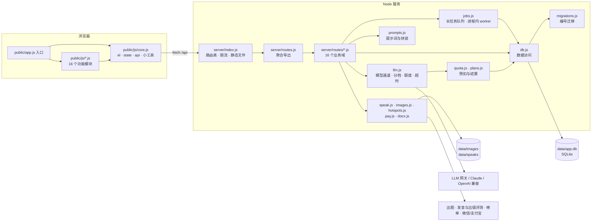

# 文案工坊 · 架构说明

给第一次接手代码的人看：模块怎么分、一次请求怎么走、改东西去哪。设计取舍的来龙去脉在 README 里。

## 一张图



## 技术栈

| 部分 | 用的是 | 说明 |
|---|---|---|
| 前端 | 原生 HTML / CSS / JavaScript（ES Modules） | 无框架、无构建，浏览器直接加载 `public/` |
| 后端 | Node.js ≥ 22.5（ESM），原生 `node:http` | 无 Express / Koa；唯一依赖 `@anthropic-ai/sdk` |
| 数据库 | SQLite，Node 内置 `node:sqlite`，WAL 模式 | 表结构在 `server/migrations.js` |
| 部署 | nginx 反代 + pm2 + rsync | `scripts/deploy-jdcloud.sh`，每日备份 `scripts/backup.sh` |
| 测试 | Node 内置 `node:test` | `npm test`：先跑 `scripts/check.js` 再跑 `tests/*.test.js` |

## 一次请求怎么走

1. `server/index.js` 收到请求：`/api/*` 先过 `limit.js` 的限流，再在 `ROUTES` 表里按方法 + 正则找处理函数；
   其余路径当静态文件（`/admin`、`/prompts`、`/start` 等有独立入口）。
2. 处理函数在 `server/routes/<业务域>.js`，统一签名 `(req, res, body, params, url)`。
   开头 `requireUser(req)` 或 `requireAdmin(req)`，结尾 `json(res, 200, {...})`；抛 `HttpError(状态码, 文案)` 由 index.js 转成 JSON 错误。
3. 要调模型时走 `llm.js` 的三个函数之一：`generateJSON`（结构化）、`generateText`（短文本）、`streamText`（流式）。
   每次调用都经过 `tracked()`：
   - 按 `FEATURE_TIER` 决定走 quality 还是 fast 档；
   - 同一用户最多 3 个并发（`LLM_MAX_INFLIGHT_PER_USER`）；
   - 额度**预扣**一笔估算，调完按真实 token **结算**多退少补，失败退回、中断按已生成字数收；
   - 写一条 `usage_events`（功能、模型、耗时、token、提示词变体）。
4. 模型输出一律在代码里校验再用：引用必须能在原文逐字找到、字段不全重试一次、凑数的提示过滤掉。

## 业务域（server/routes/）

| 文件 | 管什么 |
|---|---|
| `common.js` | 共用小工具：`json`、`requireUser`、`requireAdmin`、`describe`（错误文案）、`withRetry`、语气样本 |
| `auth.js` | 注册、登录、登出、当前用户、站点元信息 |
| `prompts.js` | 提示词说明书读取；编辑与切换版本仅管理员 |
| `admin.js` | 后台登录、用量概览、运行时配置、A/B 变体、eval |
| `personas.js` | 账号设定、内容栏目、语气样本与档案 |
| `hotspots.js` | 榜单、热点比对、题材推荐 |
| `drafts.js` | 三个方向、流式成稿、保存与历史、列表、归档、删除 |
| `review.js` | 成稿检查（`cleanReview` 是纯函数，有单测） |
| `speak.js` | 口播提示、口播录音与评测 |
| `editor.js` | 划词改写、`/` 续写、语音改稿 |
| `publish.js` | 多平台版本、配图、Word 导出 |
| `materials.js` | 素材库（`recallMaterials` 召回）与选题池 |
| `insights.js` | 发布数据回填与复盘 |
| `billing.js` | 套餐、下单、支付回调 |
| `frameworks.js` | 写法框架库、从范文拆解 |
| `jobs.js` | 任务中心：长任务的进度、取消、重试 |

## 前端模块（public/js/）

`public/app.js` 是入口：先加载 `core.js`，再加载各功能模块，最后启动。

- `core.js` 放所有模块共享的东西：DOM 引用 `el`、全局状态 `state`、`api()`、`esc`、`toast`、`markdown` 等。
  **它不 import 任何功能模块**，所以永远最先执行完，别的模块在加载时读 `el` / `state` 不会出错。
- 功能模块之间可以互相 import 函数（ES 模块里函数声明会提前可用）。
- 需要「通知」而不是「调用」的地方用 window 事件：`cw-spent`（花了点数，刷新余额）、`cw-quota`（额度不够，弹用量面板）、
  `cw-enter`（登录后进了应用）、`cw-job-done`（后台任务做完，`detail` 是任务）。

## 数据

23 张表，按用途分：

| 用途 | 表 |
|---|---|
| 账号与会话 | `users`、`sessions`、`admins`、`admin_sessions` |
| 账号设定 | `personas`、`sections`、`style_samples` |
| 创作 | `drafts`、`draft_revisions`、`speak_takes`、`frameworks` |
| 复盘 | `draft_metrics`（发布数据快照，一次回填一行） |
| 后台任务 | `jobs`（出图、口播转写与评测；worker 在 `server/jobs.js`） |
| 素材与选题 | `materials`、`topic_pool` |
| 提示词 | `prompt_revisions`、`prompt_variants`、`eval_cases`、`eval_runs`、`eval_votes` |
| 计费与运营 | `orders`、`usage_events`、`settings` |

`drafts` 里有多个 JSON 列（方向、账号快照、口播提示、多平台版本、配图、发布数据），读写在 `db.js` 的 `Drafts` 里集中处理。
录音和图片存在 `data/speaks/<用户>/`、`data/images/<用户>/`，只能由本人访问（`index.js` 的 `serveOwned`）。

## 改东西去哪

| 想改 | 去哪 |
|---|---|
| 写作规则、平台规范、调性 | `server/prompts.js`；运行时由管理员在 `/prompts` 页在线改（有版本历史） |
| 哪个功能用哪个档的模型 | `server/llm.js` 的 `FEATURE_TIER`；快档模型用 `ANTHROPIC_MODEL_FAST` / `OPENAI_MODEL_FAST` / `LLM_CAPABILITY_JSON` |
| 套餐、点数、单价 | `server/plans.js`、`server/pricing.js` |
| 新接口 | `server/index.js` 的 `ROUTES` 加一行 + 对应 `server/routes/<域>.js` 里 export 处理函数 |
| 要跑很久的活 | 在业务路由里 `defineJob` 登记一种任务，接口里 `enqueue`；前端用 `jobs.js` 的 `startJob` / `waitJob` |
| 表结构 | `server/migrations.js` 末尾加一个编号迁移 |
| 页面结构 / 样式 | `public/index.html` / `public/styles.css`（开头是设计令牌） |
| 页面行为 | `public/js/<模块>.js` |

## 本地开发

```bash
npm install
LLM_PROVIDER=mock IMAGE_PROVIDER=mock npm run dev   # 演示模式，不花钱，改完自动重启
npm test                                            # 检查 + 单测
```
